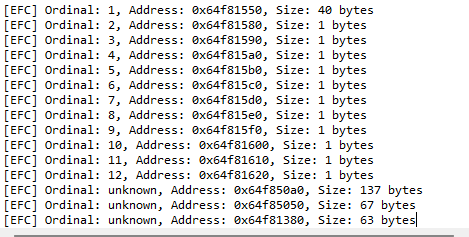

# Export Function Check
EFC is simple tool, that will help you distinguish between malicious functions and fake export function.  
EFC 是一个能帮助你区分恶意函数和伪造导出函数的小工具。

## Detail
In dll hijack, some black dll will make fake export function, some of they has obvious features that is function size. EFC will calculate function size, then we can distinguish between malicious functions and fake export function.  
在dll劫持中，有些黑dll会伪造导出函数，有一些伪造导出函数的明显特征就是函数大小。EFC会计算函数大小，这样我们就能区分恶意函数和伪造导出函数。  

Hotkey: Ctrl-Alt-E  

